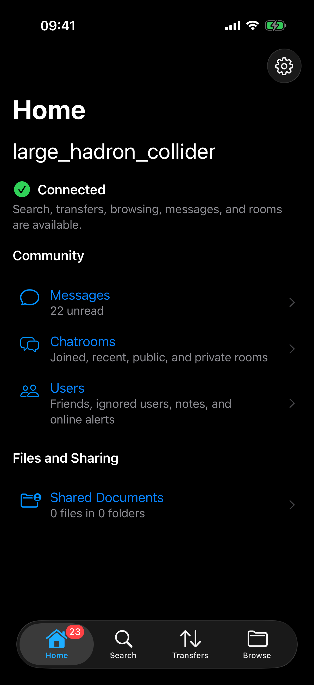
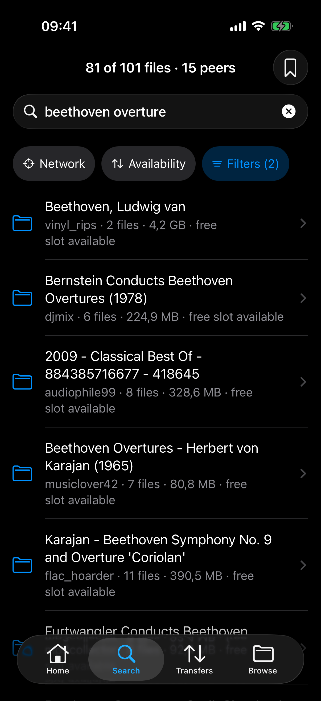
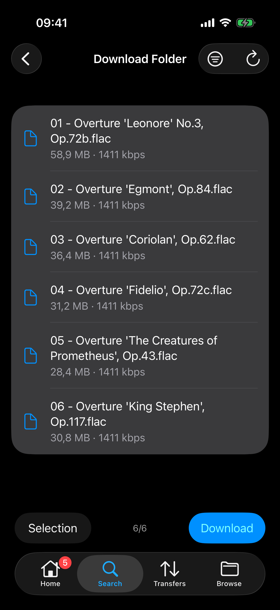
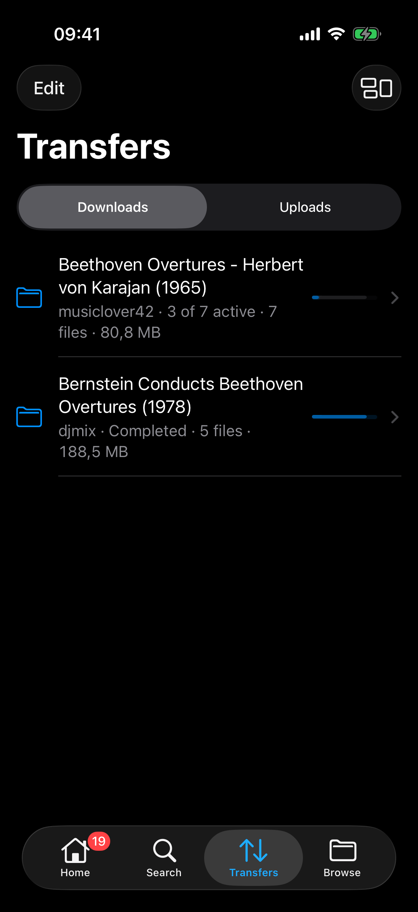
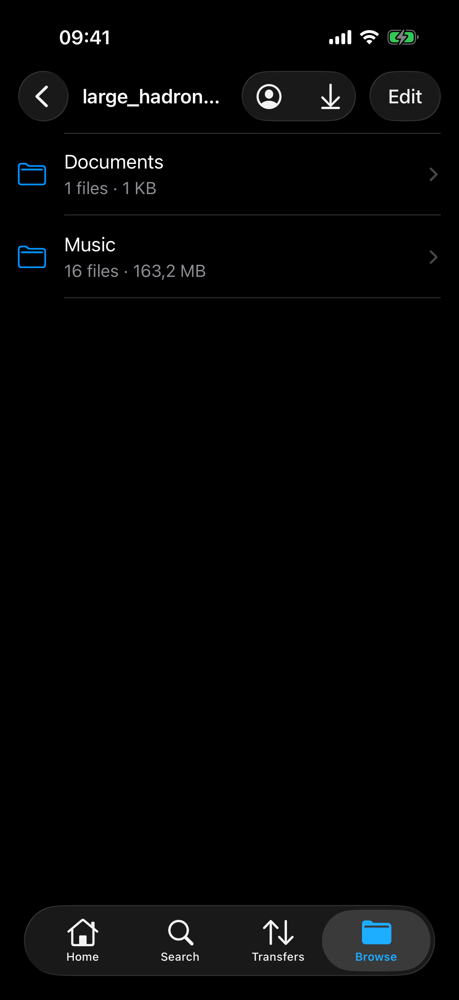
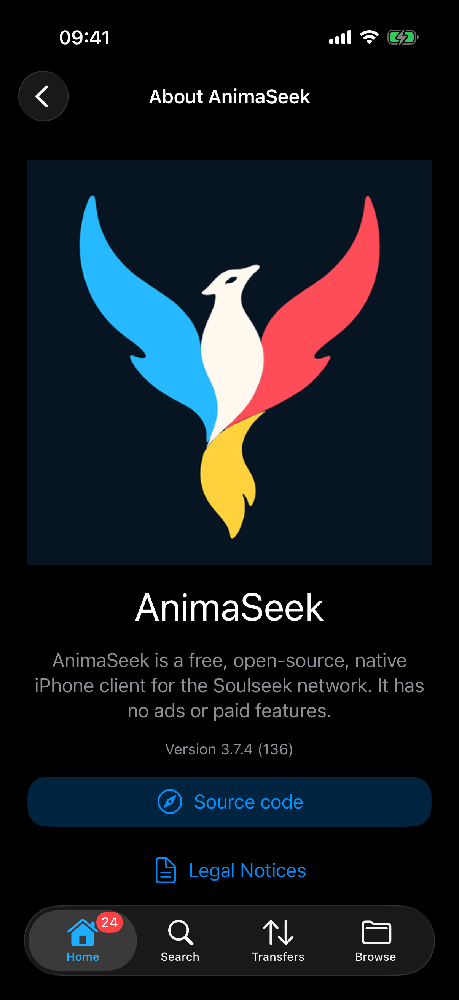

 

<h2><b>AnimaSeek</b></h2>
<h4>A Soulseek client for iPhone.</h4>

AnimaSeek is a [Soulseek](https://en.wikipedia.org/wiki/Soulseek) client for iPhone written in C#, forked from [Seeker](https://github.com/jackBonadies/SeekerAndroid) for Android, supporting downloading, searching (including wishlist and filters), sharing, messages, chatrooms, port forwarding, user info, privileges, and more.

This work uses the [Soulseek.NET](https://github.com/jpdillingham/Soulseek.NET) library for communicating with the Soulseek server and network peers. It also references the unofficial [Soulseek Protocol Documentation](https://nicotine-plus.github.io/nicotine-plus/doc/SLSKPROTOCOL.html) implemented by the developers of the [Nicotine+](https://github.com/nicotine-plus/nicotine-plus) client.

- The Soulseek server, which makes this app possible, relies on donations. Donate: [here](https://www.slsknet.org/donate.php)

This app will always be completely free and open source software, no ads, no 'premium' versions or paid features, etc.

---

## AI Usage Disclaimer

AnimaSeek is developed with the help of AI coding agents, which I use both for writing code and for generating assets. My workflow isn't fully vibed, however: it will always involve human planning as well as human reviews of any slop generated by the clankers.

I'm also not the biggest fans of what AI companies are doing (from [destroying rare books](https://futurism.com/artificial-intelligence/ai-companies-destroying-rare-books) to [the damage their data centers do to the environment](https://stpp.fordschool.umich.edu/sites/stpp/files/2025-07/stpp-data-centers-2025.pdf) and to [the communities living around them](https://theconversation.com/5-ways-data-centers-endanger-their-local-communities-and-the-country-as-a-whole-282348))
so I try to make my use of it as ethical as possible, if such an ethical use of AI can even exist. I understand if you would rather avoid this tool because of that, and I promise to keep doing things the right way. Sadly, AI is here to stay; if we are going to use it, I would rather we do so in a way that benefits the communities we are part of.

---

## Screenshots

---

## License

AnimaSeek and the inherited Seeker code are distributed under the [GNU General Public License, version 3](LICENSE). Vendored dependencies retain their own license files and upstream notices.
